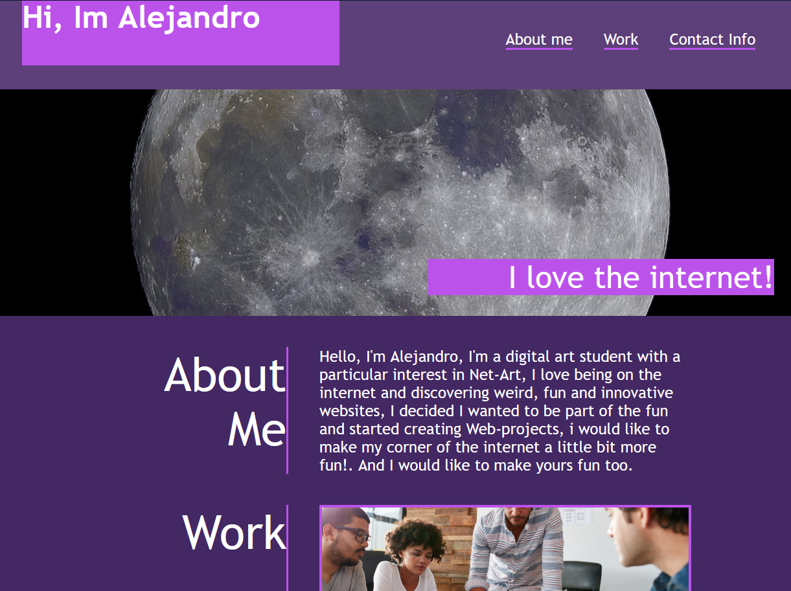

# Personal Portfolio 

## Description

This is my personal portfolio
It is built using HTML and CSS.

### Challenges
* The main challenge that i faced was making a responsive website, i found that going size by size was a bit too complicated, so i had to learn how to make a minimum size for 
the desired layout, and then once it reached a size lesser than the minimum it would switch to another layout, so instead of going size by size i tried to set the minimum amount possible of breakpoints

* The Grid layout was also a challenge for me, learning the propeties that grid has and how i could use them to make the layout was a challenge, but at the end it was worth it, I now thionk it would be more complicated using other type of display value.

* I struggled when creating the cards because I thought i had to use position absolute in order to creat the desription, I quickly found out that that choice would break my layout on smaller screen devices.

Here you can See how the page turned out:

You can visit the Website here: https://alejandro-jpeg.github.io/Personal-Portfolio/
   
